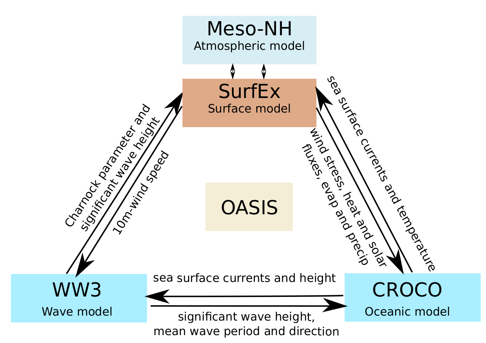

Welcome to RECOWA's documentation
============================================================

This documentation presents RECOWA (Regional Coupled Ocean–Wave–Atmosphere system), a framework for building, configuring, and running high-resolution regional coupled simulations. It provides guidance for coupling atmospheric, oceanic, and wave models using the `OASIS <https://oasis.cerfacs.fr/en/home/>`_ coupler and the XIOS server.

This documentation has been initially developed around the `Meso-NH <http://mesonh.cnrs.fr/>`_, `WW3 <https://polar.ncep.noaa.gov/waves/wavewatch>`_, and `CROCO <https://www.croco-ocean.org>`_ models, and is designed to evolve towards a more general framework capable of integrating additional models such as WRF and NEMO in the future. The possible exchanges between the different components of the coupled system are illustrated in the following figure :

   Diagram illustrating the different fields that can be exchanged between the Meso-NH/SurfEx, WW3 and CROCO models using OASIS coupler.

.. note::

   This documentation is subject to change, so don't hesitate to `send me <joris.pianezze@cnrs.fr>`_ your improvements, corrections, etc ...

Contents
************************************************************

.. toctree::
   :maxdepth: 2

   requirements/requirements
   installation/installation
   compilation/compilation
   preprocessing/preprocessing
   simulation/simulation
   togofurther/togofurther

References
************************************************************

.. bibliography::
